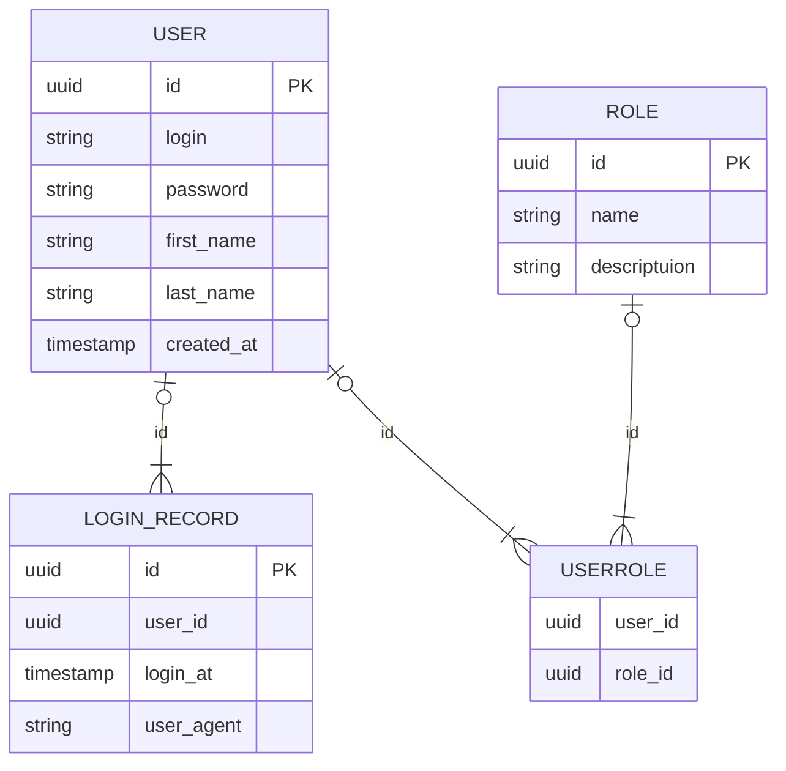
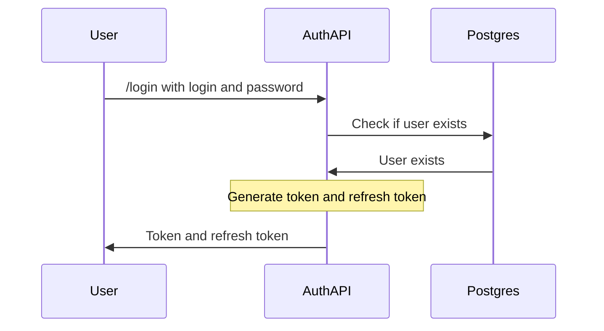
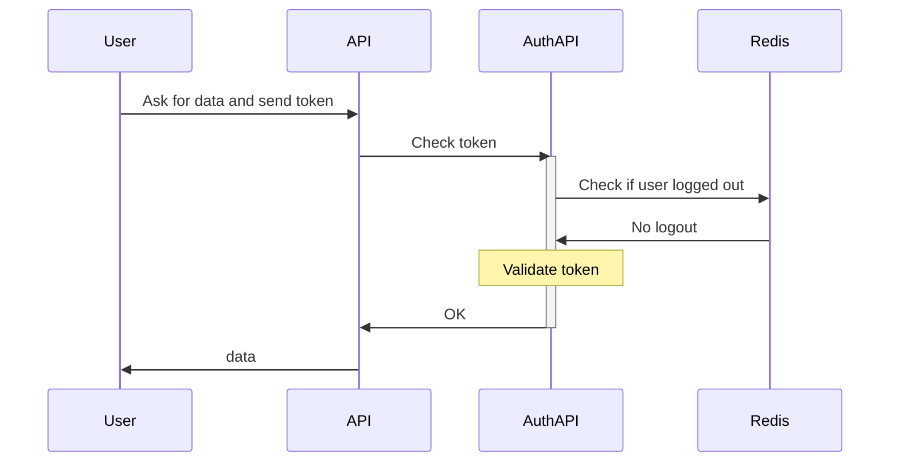
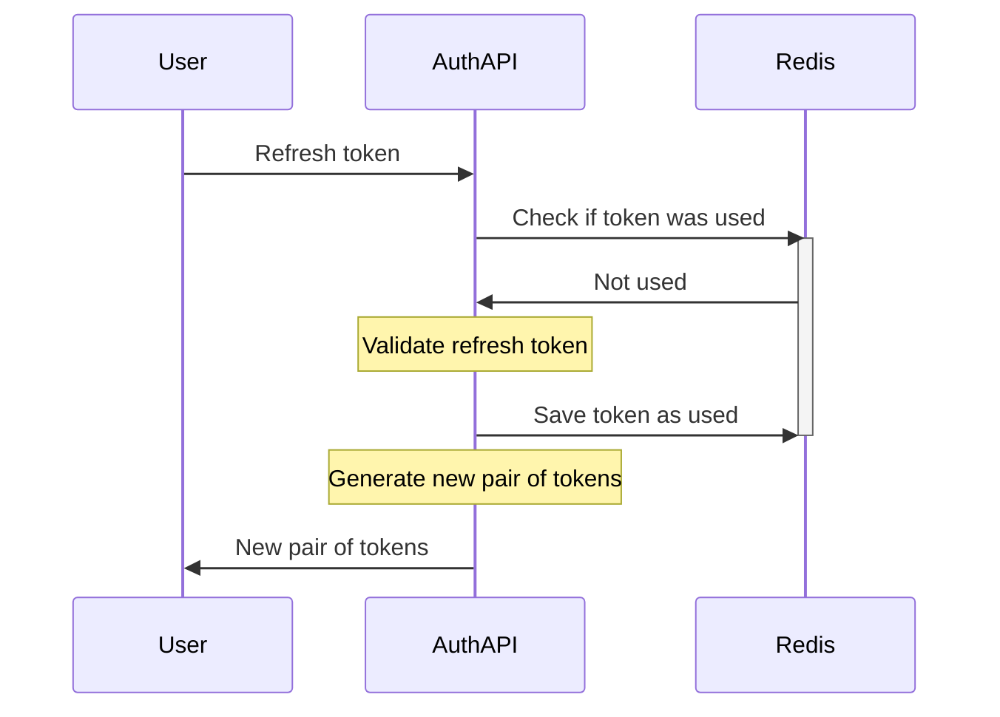
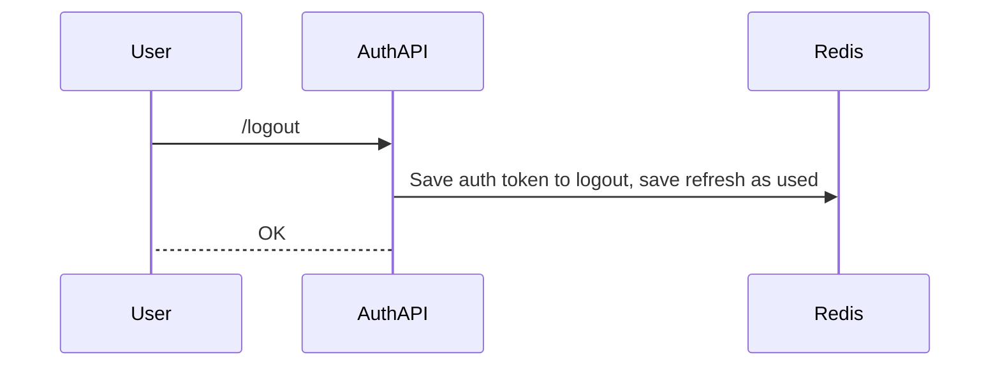

# Auth API

Сервис авторизации с системой ролей.

Используемые технологии:
- Nginx
- FastAPI
- Redis
- Postgres

Доступ предоставляется по ролям (RBAC)

## Создание суперпользователя

Для создания суперпользователя можно использовать cli:

```
python src/auth_cli.py createsuperuser
```

## Схема базы данных

Данные о пользователе, существующих ролях, история логинов, а также отношения 
между пользователями и ролями хранятся в Postgres.



## Схема аутентификации

Получение токена


Использование токена


Обновление токена


Logout


## Обработка ошибок

| Ошибка | Ответ API |
| ------ | --------- |
| Истекший токен | `401 Unauthorized` |
| Неверная подпись токена | `401 Unauthorized` |
| Нет доступа к ресурсу | `403 Forbidden` |
| Имя пользователя уже занято | `409 Conflict` |
