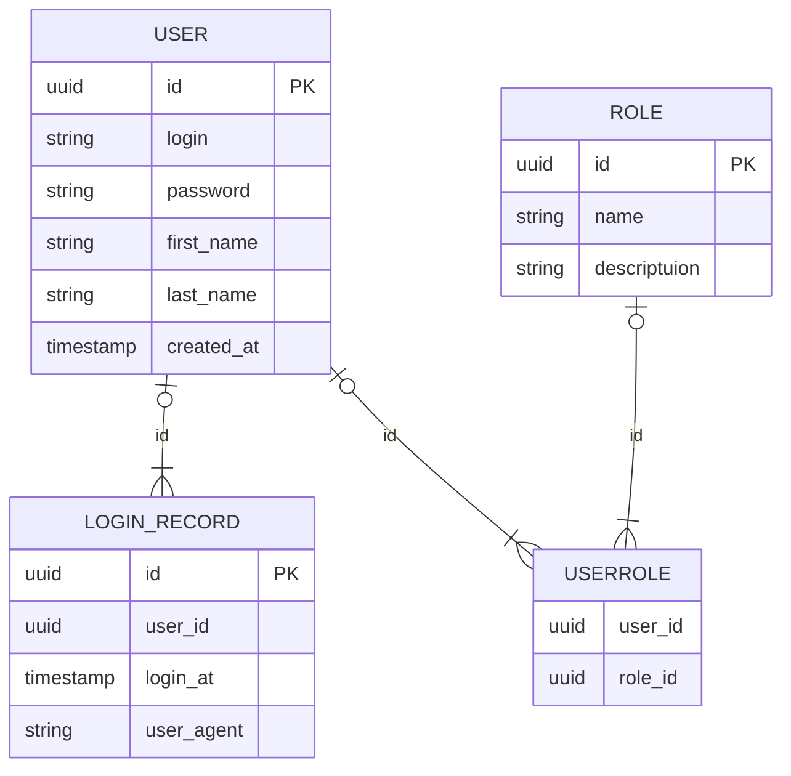
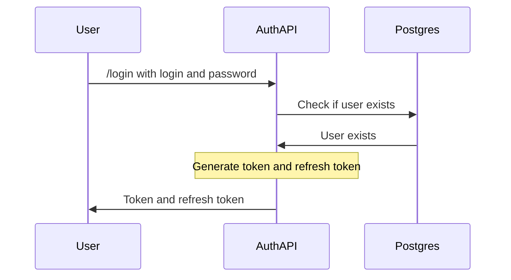
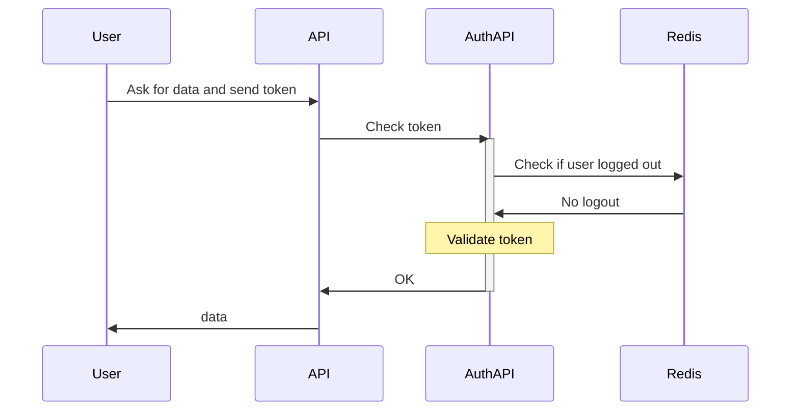
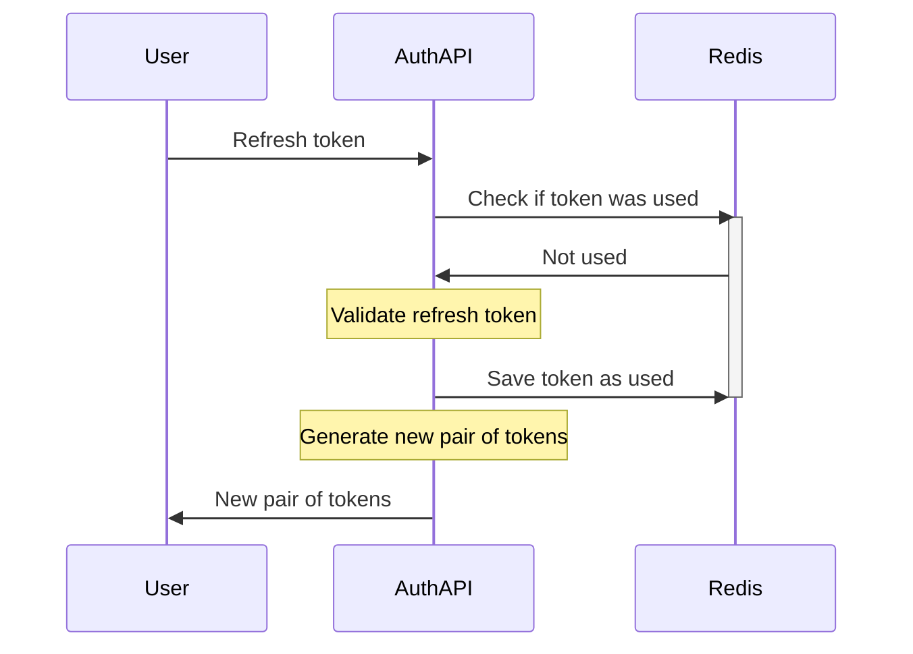
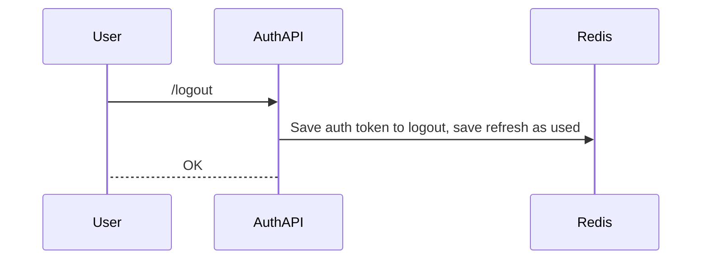

# Auth API

Centralized authentication and authorization system with Role-based permission system
and OAuth 2.0 integration with Google SSO.

Tech stack:
- Nginx
- FastAPI
- Redis
- Postgres


## Creating superuser

CLI can be used to create superuser

```
python src/auth_cli.py createsuperuser
```

## Database schema

Data about user, existing roles, login history and relationship between 
roles and users is stored in PostgreSQL



## Authentication Schema

Receiving token


Using token


Refresh token


Logout


## Errors

| Ошибка | Ответ API |
| ------ | --------- |
| Expired token | `401 Unauthorized` |
| Invalid token signature| `401 Unauthorized` |
| Not enough rights to access resource | `403 Forbidden` |
| Username is already taken | `409 Conflict` |
